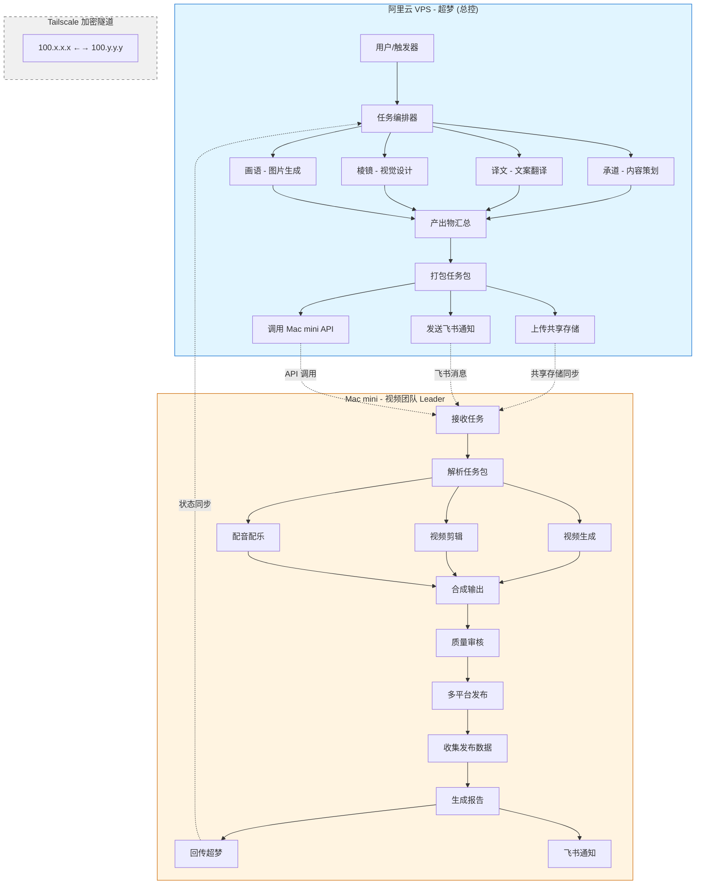
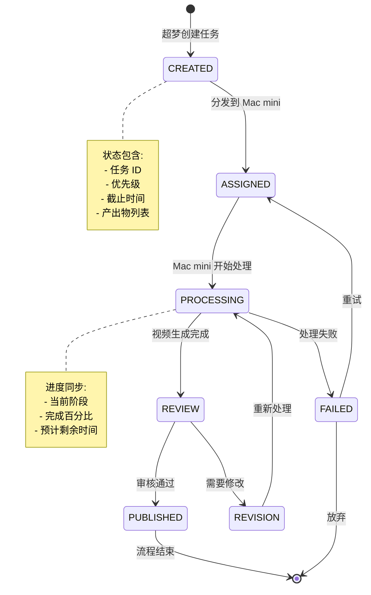
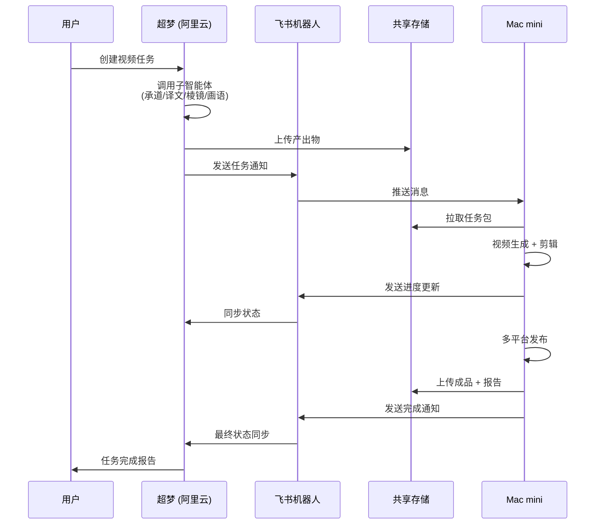
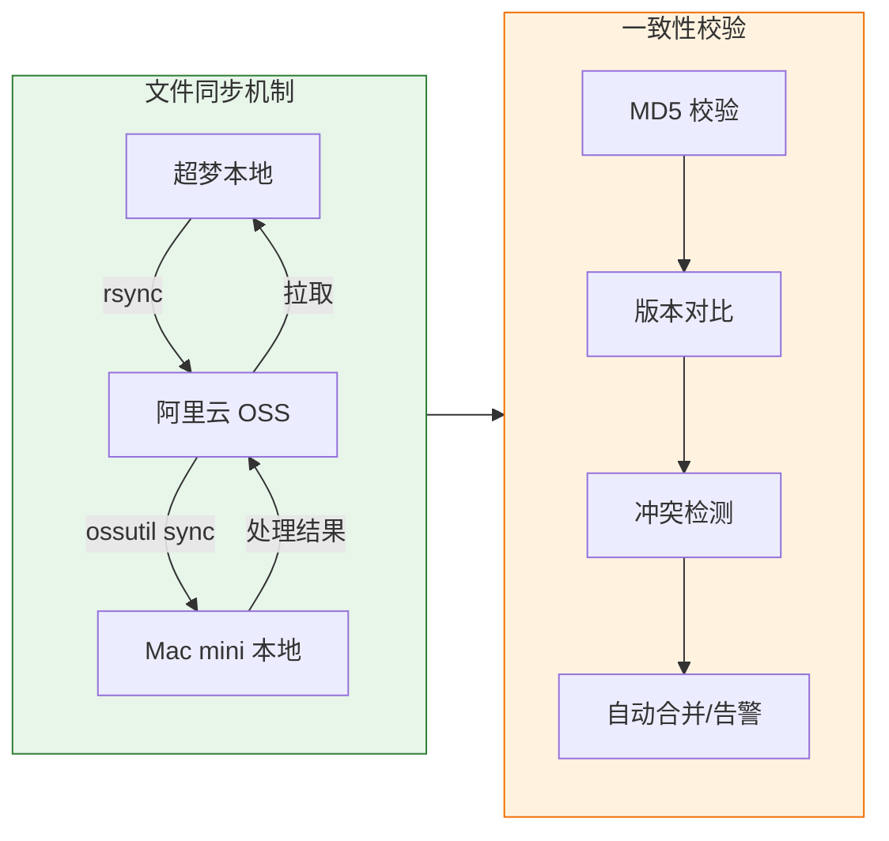
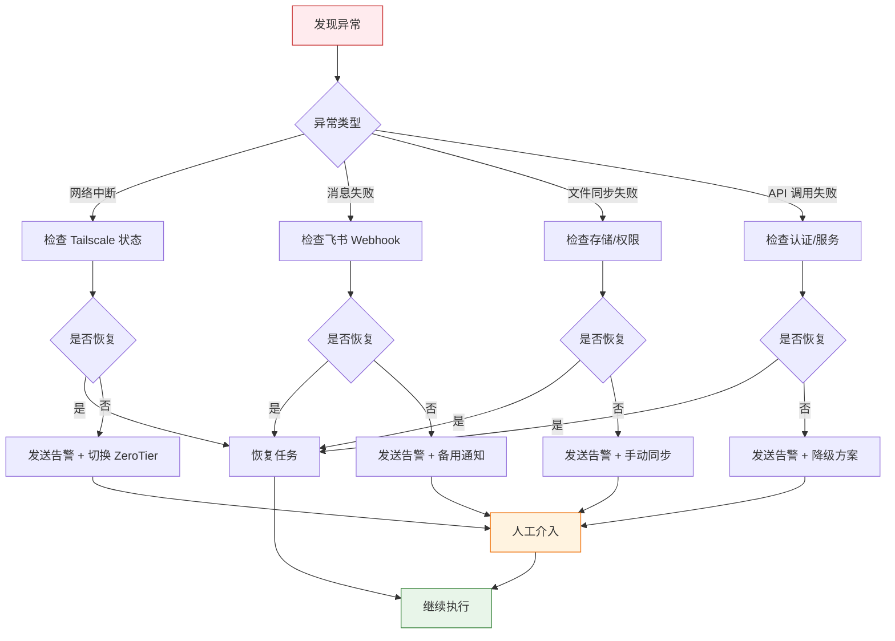
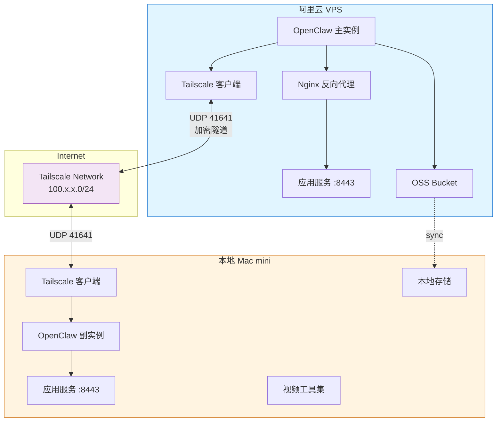

# 多实例协同工作流程图

## 主流程图

## 任务状态流转图

## 通信架构图

## 数据同步机制

## 故障处理流程

## 部署架构

---

## 图例说明

| 符号 | 含义 |
|------|------|
| ──→ | 数据流/控制流 |
| - -→ | 异步通知/消息 |
| <──> | 双向通信 |
| [.sync.] | 定期同步 |
| 🔵 | 阿里云资源 |
| 🟠 | 本地资源 |
| 🟣 | 网络层 |

---

*使用 Mermaid 渲染器查看完整图表*
